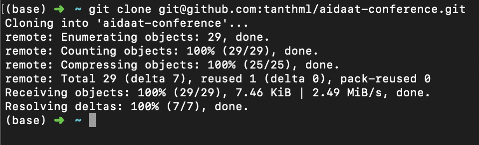

Dear researchers,

Wellcome to AIDAAT Conference,

Here is the simple tutorial how you public your source-code to AIDA-AT, after your paper have been accepted.

# *** Requirements ***

1. Knowlegde in Git.
2. Github account. 
3. Git was installed on your machine.

Watch these video to get overview about git and github : 

https://www.youtube.com/watch?v=sz6zfrQpCQg (What is Git | What is GitHub | Git Tutorial | GitHub Tutorial | Devops Tutorial | Edureka)

https://www.youtube.com/watch?v=xuB1Id2Wxak (GitHub Learning Lab: Introduction to GitHub Walkthrough)

You can explore more from reference resources:
- https://www.datacamp.com/courses/introduction-to-git-for-data-science
- https://lab.github.com/githubtraining/introduction-to-github
- google for more :-D


# Step by step

Example: Suppose that the reseacher Tan have paper accepted `000` from AIDA-AT and his GitHub account is `tanthml`, he will follow step by step below to public his code to AIDA-AT GitHub.

1. Go to AIDA-AT Conference GitHub repo : https://github.com/aidaat/aidaat-conference

2. Fork it to your GitHub account.
In this example, it will be forked to `tanthml` located at : https://github.com/tanthml/aidaat-conference


3. Clone the forked git repo to your local machine:
    For example, suppose this is my forked-repo from AIDA-AT, I will clone it to local machine:
    Open Terminal (Mac/Linux), if you are using Windows, you can download this tool: https://git-scm.com/downloads
    
    ``` cd ~ ```  # go to home directory, or your working space.
    
    ``` git clone https://github.com/<your-git-account>/aidaat-conference.git ```
    In this example: ```git clone https://github.com/tanthml/aidaat-conference.git```
    
    
4. Go to the clone repo directory, add your working results (source-code, pictures, documenation for reproduce experiments):
    
    ``` cd aidaat-conference/AIDA-AT2020 ```
        
    
    ``` git pull origin master ``` # make sure you get the latest updates.
    
    ### create a new branch for your work
    
    ``` git checkout -b your-branch-name ```
    
    `<your-branch-name>` should be short, clear and informative, follow this pattern `aida-at-2020-paper-id-xxx`, where xxx is your accepted paper ID.
    
    In my case, it will be: ``` git checkout -b aida-at-2020-paper-id-000 ```
    
    ### using a File explorer go to AIDA-AT2020 `aidaat-conference/AIDA-AT2020`
    ### copy all your source code, sample data, experiment result to your paper id folder, for example in this case: `PID_000`
      
    Use `git status` to view changes in `aidaat-conference/AIDA-AT2020`
      
    
    `BE NOTICED THAT: YOU MUST WORK INSIDE YOUR FOLDER BELONG TO YOUR PAPER ID ONLY, DO NOT CHANGE ANYTHING OUTSIDE YOUR PAPER ID FOLDER`
    
    ### add and commit your works
    ``` git add PID_000/ ```
    
    ``` git commit -m "aida-at-2020-paper-id-xxx" ```
    In this case: ``` git commit -m "aida-at-2020-paper-id-000"```
     
    
    ``` git push origin your-branch-name ```
    In this case: ``` git push origin aida-at-2020-paper-id-000 ```
     
    
5. Goto your working branches from forked repo on Github via the https://github.com/your-git-account/aidaat-conference/branches
(In my example, it is : https://github.com/tanthml/aidaat-conference/branches)
    
    and create the pull-request to AIDA-AT follow these pictures below:
    
    
    
    
6. Wait for reviews & feedbacks from AIDA-AT staffs, then it will be merged to AIDA-AT repo.

- AIDA-AT members will review and feedbacks,
    
- After review, your pull request will be approved,
    

Thank for your contributions!
