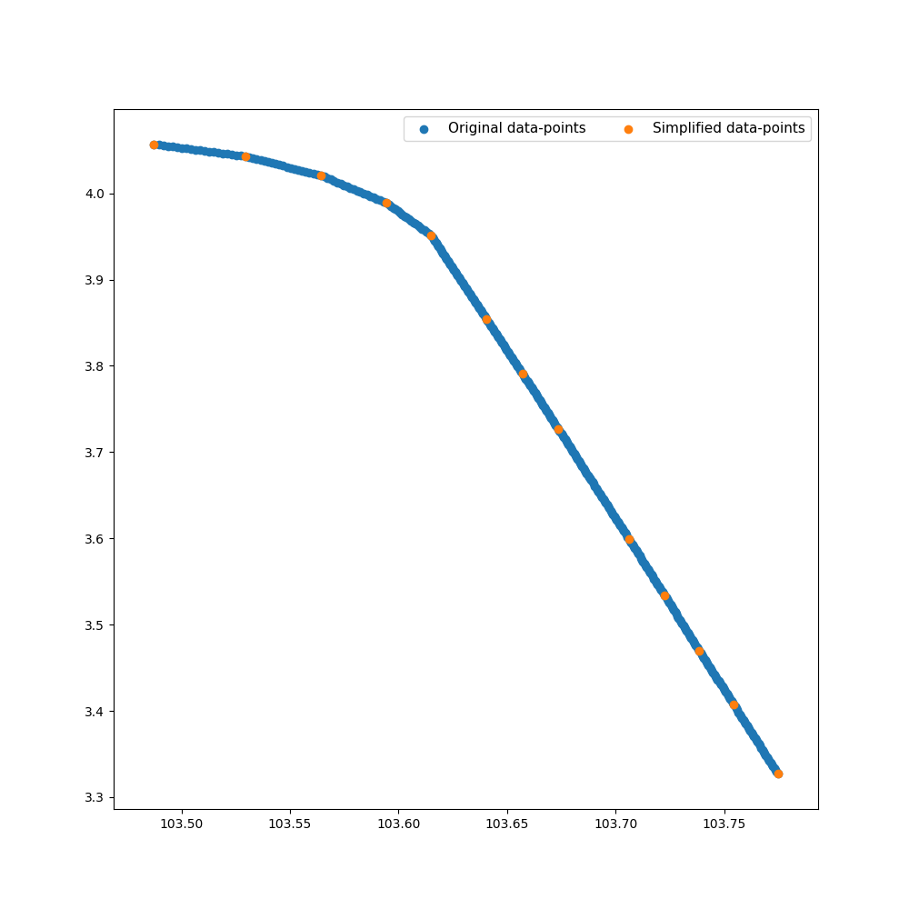

Hi,

Here is simple Python scripts for reproduce result with sample data.

Suppose my paper has been accepted by `AIDA-AT 2020` with paper id is `000`. I wrap up on my scripts for 
reproduce the experimental results.

Here is the step by step tutorial for my paper scripts.

## Description:
- Sample file: `sample_flight_data.csv`

- Contains position (Latitude, Longitude, Altitude), course and speed over time, include these column fields: 
`['FID', 'Longitude', 'Latitude', 'Altitude', 'Time', 'Speed', 'Course']`

- The main programming language is  `Python3`

- All requirement packages are listed in `requirements.txt`

- The `main.py` is the script to execute to get the analysis result with given sample data.

## Reproduce step by step:

#### Install requirement packages
```pip install -r requirements.txt```

#### Execute main.py to get result.
```python main.py --input_path sample_flight_data.csv```

#### This is how the result look like:

